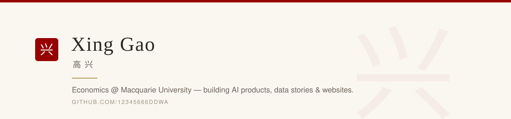

### About

Economics student at **Macquarie University**, Sydney. I build small, useful things with AI — products, data stories and websites — and ship them end-to-end: research → design → build → deploy. Most projects pair a rigorous method with a designed, browsable result you can open right in the browser.

---

### Selected work

**AI products**

- **[CoachAI](https://github.com/12345666ddwa/coachai-mvp)** — AI marking & lesson-planning coach for HSC teachers; dual-agent grading against official NESA guidelines · *Macquarie University × iSOFT team project*
- **[Mirror · 赛镜](https://github.com/12345666ddwa/mirror)** — open-source, local-first, self-evolving personal AI agent *(MIT)*
- **[Honglusi · 鸿胪寺](https://github.com/12345666ddwa/honglusi-travel-planner)** — multi-agent travel planner: one form → researched, verified, budgeted trip plans · [live sample ↗](https://12345666ddwa.github.io/honglusi-travel-planner/examples/YZ-20260814-009/plan.html)

**Data & analytics**

- **[Beijing Air Quality Datathon](https://github.com/12345666ddwa/beijing-aq-datathon)** — five-family ensemble for next-hour PM2.5 forecasting; final leaderboard **24.195** · [story site ↗](https://12345666ddwa.github.io/beijing-aq-datathon/) · [code ↗](https://github.com/12345666ddwa/beijing-aq-datathon-code)
- **[NovaCorp People Analytics](https://github.com/12345666ddwa/novacorp-people-analytics)** — attrition deep-dive + retention ROI playbook · [live dashboard ↗](https://12345666ddwa.github.io/novacorp-people-analytics/)

**Web design — restaurant portfolio**

- **[Zhao Zai Er · 趙崽兒](https://github.com/12345666ddwa/zhaozaier)** — fusion noodle house, Macquarie Centre · [live ↗](https://12345666ddwa.github.io/zhaozaier/)
- **[Thirty 7even](https://github.com/12345666ddwa/thirty7even)** — modern Australian × Taiwanese, Sydney · [live ↗](https://12345666ddwa.github.io/thirty7even/)
- **[Chaozhou Malaya](https://github.com/12345666ddwa/chaozhou-malaya)** — Teochew × Malaysian Chinese kitchen, Melbourne · [live ↗](https://12345666ddwa.github.io/chaozhou-malaya/)
- **[restaurant-web-service](https://github.com/12345666ddwa/restaurant-web-service)** — the service landing page itself · [live ↗](https://12345666ddwa.github.io/restaurant-web-service/)

**Tools & experiments**

- **[douyin2skill](https://github.com/12345666ddwa/douyin2skill)** — turn Douyin tutorial videos into reusable AI skills *(MIT)*
- **[RECon demo](https://github.com/12345666ddwa/recon-demo)** — interactive app concept for climate-risk-aware home renovation (Climate Hack-tion 2026) · [live ↗](https://12345666ddwa.github.io/recon-demo/)

---

**Toolbox** — Python · SQL · Stata · Tableau · LLM APIs & agent pipelines · HTML/CSS/JS

📍 Sydney, Australia
<!-- TODO(Xing): add LinkedIn URL above once profile is live -->
